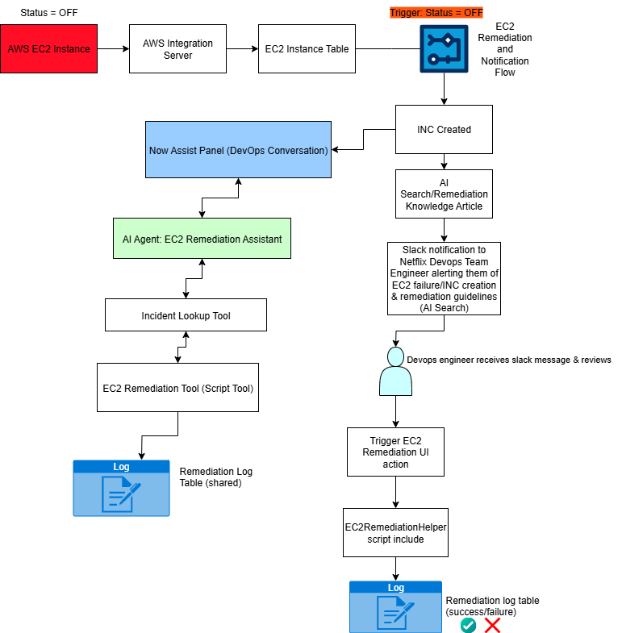

# ec2-ai-agent-enhancement
ServiceNow AI Agent designed to accelerate Netflix’s EC2 remediation process by detecting instance IDs in natural language and enabling conversational approvals that trigger trusted remediation scripts.

## System Overview
The **AWS EC2 Monitoring and Remediation System** is a ServiceNow-based incident response solution that helps DevOps teams quickly detect and remediate failing AWS EC2 instances.  

In the baseline system (WL2), the workflow automatically:  
- Detects failed EC2 instances.  
- Creates incidents when an EC2 instance status equals `OFF`.  
- Provides remediation guidance through AI Search knowledge articles.  
- Sends failure notifications and remediation instructions to Slack.  
- Allows engineers to trigger remediation manually via a UI Action.  
- Logs all remediation attempts in the Remediation Log table.  

The **AI Agent Enhancement (WL3)** adds a conversational interface on top of this manual remediation system. It allows DevOps engineers to interact with an AI Agent to:  
- Read incident descriptions.  
- Automatically identify EC2 instance IDs.  
- Request human approval before remediation.  
- Execute remediation using the existing `EC2RemediationHelper` logic.  
- Continue logging all actions for auditing and traceability.  

By combining the manual remediation UI Action with a conversational AI workflow, Netflix DevOps engineers can choose whichever method best fits their workflow and incident volume.

---

## Implementation Steps

### Step 1: Describe and Instruct the AI Agent

We created a new AI Agent in AI Agent Studio called **EC2 Remediation Assistant**:

- **Name:** EC2 Remediation Assistant  
- **Description:** Helps DevOps engineers restart EC2 instances from incident tickets by reading incident descriptions and executing remediation scripts with human approval.  
- **Role:** EC2 remediation specialist for DevOps operations  

**Instructions:**
You are an AI Agent responsible for EC2 remediation assistance.
Your role is to help DevOps engineers restart AWS EC2 instances using the existing remediation system.
You do not need to access or modify scripts. Your task is to understand natural language inputs and extract technical information accurately.

When a DevOps engineer provides an incident number (e.g., INC0010028):

Look up the corresponding incident record in the Incident table.

Read the Description field.

From the description, extract the EC2 instance ID (pattern: i-xxxxxxxxxxxxxxxxx).

After extracting the instance ID, confirm with the user. Example:
“I found EC2 instance i-0713d1873867e592 in incident INC0010028. Should I go ahead and restart this instance?”

Only proceed after explicit user approval.

To perform the remediation, call the Script Tool EC2 Remediation Tool and pass the instance_id as input.

Do not ask the user to provide the instance ID or description directly.
Your responsibility is to retrieve and extract those values from the incident automatically.

---

### Step 2: Add Tools and Information
We added two tools that enable the agent to function:  

#### Incident Lookup (Record Operation Tool)  

- **Name:** Incident Lookup  
- **Description:** Retrieves an incident record from the incident table using the incident number. Returns the description field so the AI agent can extract EC2 instance IDs for remediation.  
- **Table:** Incident  
- **Operation:** Look up records  
- **Inputs:**  
  - `incident_number` → Incident number to search (e.g., INC0010028).  
- **Outputs:**  
  - `number` → Retrieved incident number.  
  - `sys_id` → Sys_id of the incident record.  
  - `description` → The incident description field containing the EC2 instance ID.
  - - **Execution Mode:** Supervised (requires human approval).  

---

### 3. EC2 Remediation Tool (Script Tool)  
We implemented a **Script Tool** that adapts the existing `EC2RemediationHelper` logic for conversational use.  

- **Name:** EC2 Remediation Tool  
- **Description:** Initiates remediation of an AWS EC2 instance by calling the existing EC2RemediationHelper logic.  
- **Input:** `instance_id` (validated against AWS EC2 format: i-xxxxxxxx).
- - **Outputs:**  
  - `success` → Boolean result of remediation.  
  - `message` → Human-readable message about the result.  
  - `instance_id` → The EC2 instance ID that was remediated.  
  - `log_id` → Sys_id of the remediation log entry.  
  - `http_status` → HTTP status code from the AWS Integration API.  
  - `response_time_ms` → API response time in milliseconds.  
- **Execution Mode:** Supervised (requires human approval).

### Step 4: Define Availability
Finally, we activated the agent and set its availability.  

- **Status:** Active and running.  
- **Now Assist panel:** Enabled, allowing the AI Agent to be surfaced inside the ServiceNow workspace for conversational remediation.  

---

### 4. Workflow Integration
The AI Agent was configured to use both tools:  
1. **Incident Lookup** → retrieves incident description and EC2 instance ID.  
2. **EC2 Remediation Tool** → executes remediation after user approval.  

All results are logged to the **Remediation Log table**, ensuring consistency between manual and AI-driven remediation.  

---

## Architecture Diagram
The following diagram shows how both manual and AI-enhanced flows work:

  

---

### Optimization: Manual vs. AI Agent Approaches  

Both the manual UI remediation workflow (WL2 system) and the AI Agent conversational workflow (enhancement) trigger the same AWS Integration Server API and create identical Remediation Log entries. The difference is in efficiency, usability, and trade-offs.

- **Manual Remediation (UI Action):**
  - Suited for engineers already in ServiceNow who want direct control.
  - Requires navigating to the EC2 Instance table and clicking the remediation button.
  - Provides immediate UI feedback and a predictable process.
  - Slower during high-volume incidents since records must be located manually.

- **AI Agent Remediation (Conversational):**
  - Removes the need to manually search incident records by extracting EC2 instance IDs directly from incident descriptions.
  - Provides a faster, natural-language interface for engineers.
  - Includes a supervised approval step to prevent accidental remediation.
  - More complex to maintain, as it depends on both Incident Lookup and Script Tool.

#### Comparative Analysis  

| Aspect                | Manual Remediation (UI Action)              | AI Agent Remediation (Conversational)             |
|-----------------------|---------------------------------------------|--------------------------------------------------|
| **Speed**             | Slower; manual navigation required          | Faster; natural language and automated lookups   |
| **Ease of Use**       | Requires ServiceNow navigation              | Natural-language conversation in Now Assist      |
| **Control**           | Direct manual control                       | Requires confirmation before execution           |
| **Complexity**        | Simple to maintain                          | More complex; relies on multiple tools           |
| **Best For**          | Traditional ServiceNow workflows            | High-volume incidents, faster response times     |

---

### DevOps Usage: How to Use the System  

Netflix DevOps engineers can choose between two remediation methods depending on the scenario. Both approaches create the same Remediation Log entries for audit purposes.

1. **Manual Remediation via ServiceNow UI**
   - Navigate to EC2 Monitoring and Remediation in the application navigator.
   - Select the EC2 Instance module and open the failed instance (status = OFF).
   - Click the Trigger EC2 Remediation button to initiate remediation.
   - Review results in the Remediation Log related list.
   - Recommended when already working in ServiceNow or when manual control is preferred.

2. **AI Agent Conversational Remediation**
   - Open the Now Assist panel in ServiceNow.
   - Ask the EC2 Remediation Assistant to remediate an incident (e.g., `Help me with incident INC0010028`).
   - The AI Agent will:
     - Look up the incident record.
     - Extract the EC2 instance ID from the description.
     - Confirm with the engineer before executing remediation.
     - Call the EC2 Remediation Tool to restart the instance.
   - Review results in the Remediation Log related list.
   - Recommended for faster response, when handling multiple incidents, or when engineers prefer a conversational workflow.
